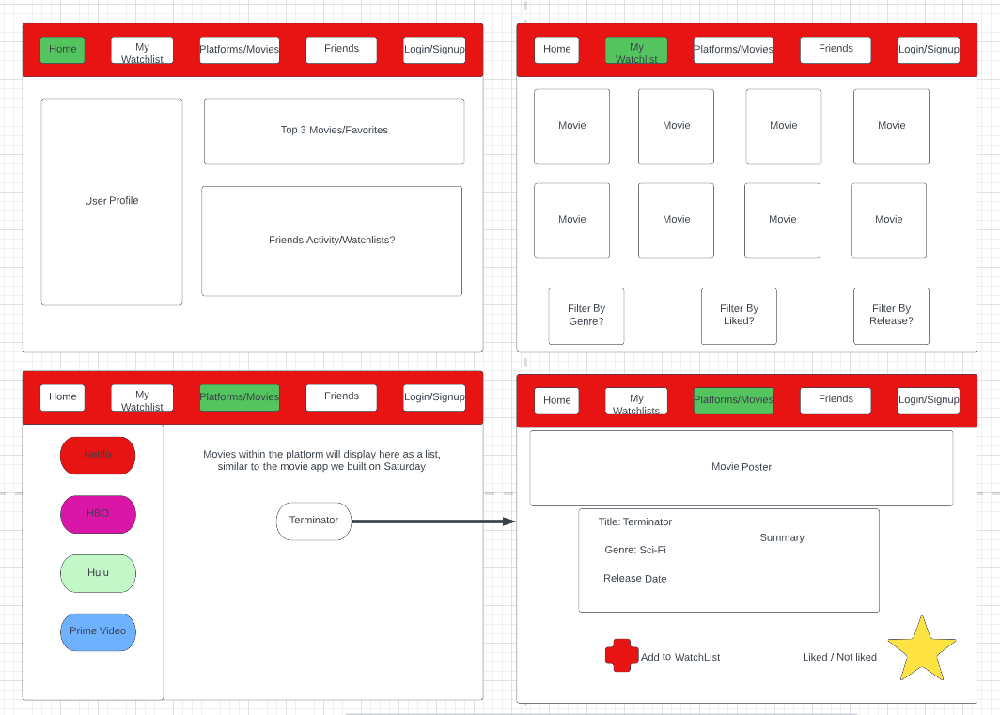

### Your group members

- Joshua Lawlor [@joshlawlor](https://github.com/joshlawlor) 
- Joshua Garst [@testler](https://github.com/testler)       
- Ben Broad [@benb](https://github.com/benb)               
- Sloane Smith [@ss18026](https://github.com/ss18026)

### Your project idea 

An app that help you find movies you want to watch, accross platforms.  Netflix, hulu, apple TV+ create a watchlist that spans across them all

### List of models and their properties

1. Movie{
    genre: String,
    platform: String,
    image: String,
    summary: String
}

2. User{
    email: String,
    username: String,
    password: String,
    watchList: []
}

### Scrum manager/project manager's name

[@joshlawlor](https://github.com/joshlawlor) Joshua Lawlor

### User stories

- As a user, I want to be able to login using to access my WatchList
- As an Admin, I want to be able to access and edit Users and Movies
- As a Developer, I want to access the models and Data easily
- As a User, I want to see an extensive list of movies that I can pick from
- As a User, I want to be able to rate and review Movies
- As a user, I want to see the movies I have favorited to watch
- As a User, I want to update my list of movies to watch
- As a User, I want to add friends and compare/contrast movies we want to watch

### Wireframes

